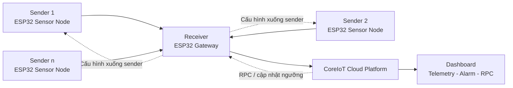

# Vaccine Cold Chain Monitoring - Project Overview

## Giới thiệu

Đây là dự án IoT phục vụ bài toán **giám sát chuỗi lạnh vaccine** theo thời gian thực. Mục tiêu chính của hệ thống là theo dõi các điều kiện bảo quản như **nhiệt độ**, **độ ẩm** và **trạng thái bất thường** tại nhiều điểm đo khác nhau, sau đó tập trung dữ liệu về một gateway trung tâm và đồng bộ lên nền tảng cloud để quan sát từ xa.

Dự án hướng đến việc giải quyết những khó khăn thường gặp trong vận hành chuỗi lạnh, ví dụ:
- Khó giám sát liên tục nếu chỉ kiểm tra thủ công theo ca.
- Khó phát hiện sớm các thời điểm vượt ngưỡng trong thời gian ngắn.
- Thiếu dữ liệu tập trung để truy vết, cảnh báo và theo dõi lịch sử vận hành.

## Dự án này làm gì?

Hệ thống được xây dựng theo mô hình nhiều thiết bị đo ở biên và một thiết bị trung tâm thu gom dữ liệu:
- **Sender** đóng vai trò thiết bị hiện trường, tạo hoặc thu thập dữ liệu nhiệt độ, độ ẩm, vị trí và trạng thái AI.
- **Receiver** đóng vai trò gateway, nhận dữ liệu từ các sender, quản lý danh sách thiết bị, đồng bộ cấu hình và gửi dữ liệu lên cloud.
- **CoreIoT** là nơi hiển thị dashboard, lưu telemetry, nhận cảnh báo và cho phép điều khiển cấu hình từ xa.

Nói ngắn gọn, dự án giúp biến nhiều điểm đo phân tán thành một hệ thống giám sát tập trung, có thể theo dõi tại chỗ lẫn từ xa.

## Luồng hoạt động tổng quát

## Giá trị chính của hệ thống

Hệ thống này không chỉ để hiển thị nhiệt độ và độ ẩm, mà còn hướng tới một quy trình giám sát hoàn chỉnh:
- Giúp phát hiện sớm các điều kiện bảo quản bất thường.
- Giúp tập trung dữ liệu từ nhiều thiết bị về một điểm quản lý chung.
- Giúp theo dõi từ xa thông qua nền tảng CoreIoT.
- Giúp làm nền tảng cho cảnh báo, truy vết và mở rộng trong các hệ thống chuỗi lạnh thực tế.

## Kịch bản sử dụng điển hình

Trong một mô hình triển khai mẫu, mỗi sender đại diện cho một vị trí bảo quản hoặc một điểm đo độc lập. Các sender gửi dữ liệu về receiver qua mạng nội bộ. Receiver sau đó chuyển tiếp dữ liệu này lên CoreIoT để người vận hành có thể:
- xem tình trạng từng thiết bị,
- theo dõi nhiệt độ và độ ẩm theo thời gian,
- nhận cảnh báo khi có dấu hiệu bất thường,
- thay đổi ngưỡng phát hiện từ dashboard.

## Nội dung chính của thư mục này

Thư mục `Report` tập trung vào **tài liệu và mô tả dự án**, không phải nơi chứa toàn bộ firmware chính. Nội dung trong đây phục vụ việc trình bày và giải thích hệ thống, bao gồm:
- báo cáo LaTeX,
- hình ảnh minh họa,
- sơ đồ,
- tài liệu mô tả luồng hoạt động và kết quả thực nghiệm.

## Tài liệu trung tâm

File quan trọng nhất trong thư mục này là:
- `IOT_Application.tex`

Đây là tài liệu mô tả đầy đủ bối cảnh bài toán, mục tiêu hệ thống, thiết kế giải pháp, luồng hoạt động và kết quả thực nghiệm của dự án.

## Kết luận ngắn

Về bản chất, đây là một dự án **IoT gateway-based monitoring system** cho bài toán chuỗi lạnh vaccine. Hệ thống cho phép nhiều sender gửi dữ liệu về một receiver trung tâm, sau đó receiver đồng bộ dữ liệu lên CoreIoT để phục vụ giám sát, cảnh báo và quản lý tập trung.

README này nhằm giúp người đọc hiểu nhanh dự án dùng để làm gì và các thành phần chính tương tác với nhau như thế nào trước khi đi sâu vào tài liệu chi tiết.
