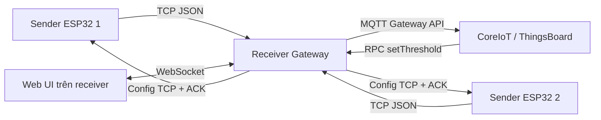
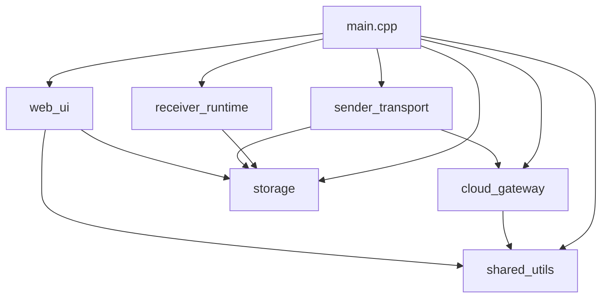
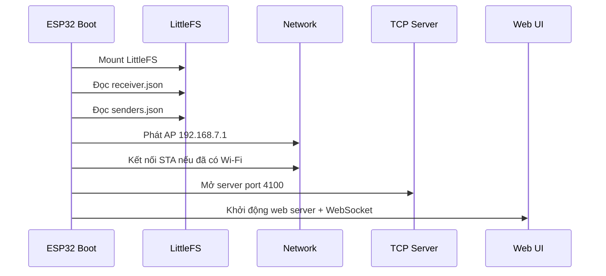
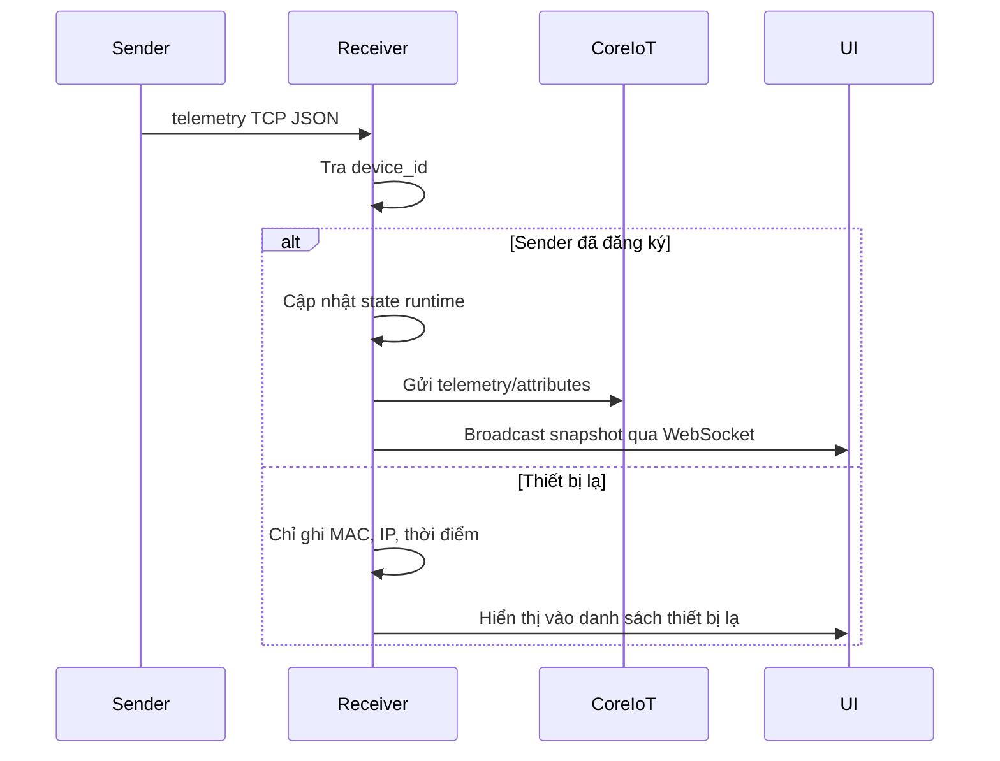
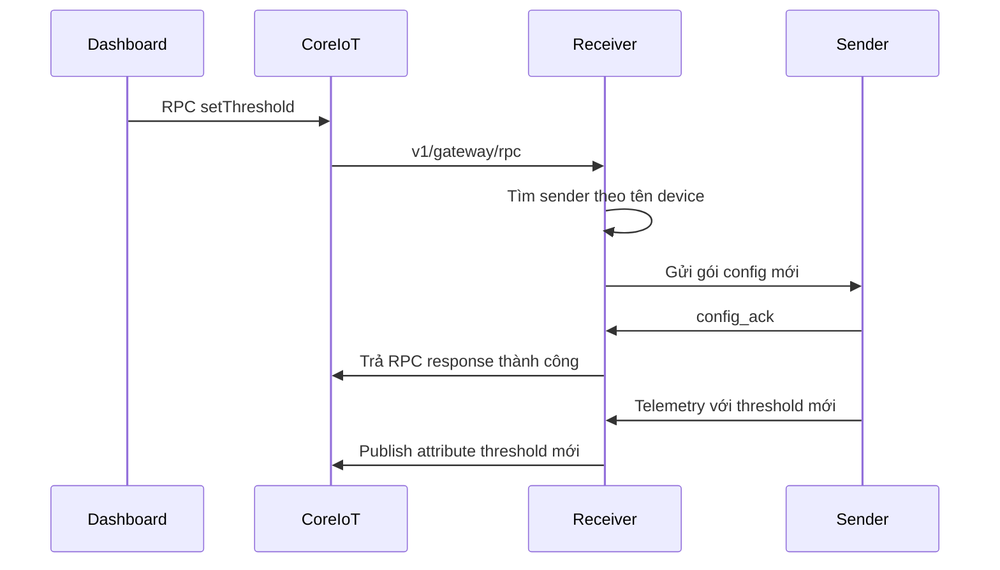

# Receiver Gateway

## 1. Tổng quan

Thư mục `Receiver` chứa firmware cho **gateway trung tâm** của hệ thống IoT. Gateway chạy trên `ESP32-S3` và đảm nhiệm vai trò:

- phát Wi-Fi cấu hình để người dùng truy cập giao diện quản trị;
- kết nối vào mạng Wi-Fi nội bộ;
- mở `TCP server` để nhiều sender gửi dữ liệu về;
- phân loại sender thành:
  - **thiết bị đã quản lý**;
  - **thiết bị lạ**;
- đồng bộ dữ liệu của sender lên **CoreIoT** theo mô hình **gateway + sub-device**;
- nhận RPC từ CoreIoT để đổi `threshold` cho đúng sender;
- lưu bền vững cấu hình receiver và danh sách sender trong `LittleFS`.

Nói ngắn gọn, receiver là “bộ não trung tâm” của toàn hệ:

```text
Sender 1 ----\
              >---- Receiver Gateway ----> CoreIoT
Sender 2 ----/
```

## 2. Mục tiêu của project

Project được thiết kế để giải quyết bài toán:

- có nhiều sender cùng hoạt động trong một mạng nội bộ;
- sender tự đo đạc hoặc mô phỏng dữ liệu và tự chạy AI cục bộ;
- receiver chỉ làm nhiệm vụ thu nhận, quản lý, điều phối và đẩy dữ liệu đi;
- người dùng có thể quản lý sender theo tên thân thiện thay vì chỉ nhìn địa chỉ MAC;
- dashboard CoreIoT vẫn điều chỉnh được `threshold` cho từng sender qua RPC.

Các mục tiêu kỹ thuật chính:

1. Hỗ trợ động tối đa `10 sender`.
2. Tách sender đã đăng ký và sender lạ rõ ràng.
3. Không xử lý nặng cho sender lạ để tiết kiệm tài nguyên.
4. Đảm bảo đồng bộ hai chiều:
   - sender gửi telemetry lên receiver;
   - receiver gửi cấu hình xuống sender;
   - CoreIoT có thể điều khiển ngược về sender thông qua receiver.

## 3. Vai trò của receiver trong toàn hệ thống

Receiver không đo cảm biến, không chạy AI. Mọi dữ liệu nghiệp vụ đến từ sender.

Receiver chịu trách nhiệm:

- **quản lý kết nối mạng**:
  - phát AP cấu hình tại `192.168.7.1`;
  - kết nối STA vào Wi-Fi người dùng nhập;
  - nếu vào được mạng `/24`, receiver cố gắng khóa địa chỉ STA về đuôi `.100`.
- **lắng nghe dữ liệu sender** qua `TCP port 4100`;
- **gắn device_id = MAC** để định danh sender;
- **lưu bảng ánh xạ MAC -> tên sender**;
- **đẩy dữ liệu lên CoreIoT** dưới dạng sub-device;
- **nhận RPC `setThreshold`** từ CoreIoT và gửi xuống sender;
- **phát hiện sender offline** và gửi `disconnect` lên cloud.

## 4. Kiến trúc tổng thể

### 4.1 Sơ đồ mức cao



### 4.2 Phân lớp bên trong receiver



## 5. Cấu trúc thư mục

```text
Receiver/
├─ boards/                Cấu hình custom board PlatformIO
├─ data/                  Giao diện web nạp vào LittleFS
│  ├─ index.html
│  ├─ script.js
│  └─ styles.css
├─ src/
│  ├─ app_state.*         Hằng số, struct, trạng thái dùng chung
│  ├─ cloud_gateway.*     MQTT Gateway API, RPC, telemetry, attributes
│  ├─ receiver_runtime.*  Wi-Fi, timeout, offline, retry cấu hình
│  ├─ sender_transport.*  TCP server, parse JSON sender, ACK/config
│  ├─ shared_utils.*      Hàm tiện ích tra cứu, chuẩn hóa, reset state
│  ├─ storage.*           Đọc/ghi LittleFS
│  ├─ web_ui.*            WebSocket + snapshot UI
│  └─ main.cpp            Vòng đời điều phối chính
└─ platformio.ini         Cấu hình build
```

## 6. Cơ chế định danh sender

Mỗi sender được định danh bằng:

- `device_id = MAC`

Receiver không tạo `device_id` riêng. Cách làm này có lợi thế:

- không cần quy ước mã nội bộ phức tạp;
- sender quen hay lạ đều được nhận diện theo cùng một khóa;
- khi xóa sender khỏi danh sách quản lý, nếu sender đó gửi lại dữ liệu thì nó trở về nhóm **thiết bị lạ** ngay.

### 6.1 Hai nhóm sender

#### a. Sender đã quản lý

Là sender có `device_id` nằm trong `senders.json`.

Receiver sẽ:

- nhận telemetry đầy đủ;
- hiển thị card chính thức trên UI;
- đẩy dữ liệu lên CoreIoT;
- cho phép đổi tên và chỉnh threshold;
- route RPC từ CoreIoT đến đúng sender.

#### b. Thiết bị lạ

Là sender gửi đến nhưng `device_id` chưa có trong danh sách lưu.

Receiver chỉ:

- ghi nhận `MAC`, `IP`, `thời điểm xuất hiện`, `số lần thấy`;
- hiển thị trong khu “Thiết bị lạ”;
- chờ người dùng thêm vào danh sách quản lý.

Receiver **không** xử lý telemetry sâu và **không** đẩy dữ liệu của thiết bị lạ lên cloud.

## 7. Cơ chế mạng

### 7.1 AP cấu hình

Receiver luôn phát một AP cấu hình:

- IP: `192.168.7.1`
- SSID: dựa trên MAC của chính receiver, ví dụ `Receiver-ABCDEF12`
- Password: theo hằng số trong code

Mục đích:

- giúp người dùng luôn có điểm truy cập để mở giao diện quản lý;
- cấu hình được Wi-Fi và CoreIoT ngay cả khi receiver chưa vào được router chính.

### 7.2 STA nội bộ

Khi người dùng nhập Wi-Fi:

- receiver kết nối vào mạng đó ở chế độ `STA`;
- nếu subnet là dạng `/24`, receiver cố gắng dùng địa chỉ đuôi `.100`;
- điều này giúp sender dễ suy ra IP receiver trong mạng nội bộ.

Ví dụ:

- receiver vào mạng `192.168.1.x`
- receiver cố gắng giữ IP `192.168.1.100`

### 7.3 Giao tiếp sender -> receiver

Sender kết nối tới:

- `receiver_ip:4100`

Trong đó:

- `receiver_ip` có thể do sender nhập tay;
- hoặc sender suy ra từ IP STA hiện tại theo quy tắc đổi đuôi thành `.100`.

## 8. Giao thức TCP giữa sender và receiver

Giao thức hiện tại dùng:

- `TCP`
- JSON theo từng dòng
- mỗi message kết thúc bằng ký tự xuống dòng `\n`

### 8.1 Gói telemetry từ sender

Ví dụ:

```json
{
  "type": "telemetry",
  "device_id": "AA:BB:CC:DD:EE:FF",
  "temperature": 29.8,
  "humidity": 71.2,
  "threshold": 0.55,
  "ai_score": 0.21,
  "ai_status": "NORMAL",
  "latitude": 10.762622,
  "longitude": 106.660172,
  "timestamp": 1776037200000
}
```

### 8.2 Gói cấu hình từ receiver gửi xuống sender

Ví dụ:

```json
{
  "type": "config",
  "device_id": "AA:BB:CC:DD:EE:FF",
  "name": "Sender 01",
  "threshold": 0.60,
  "config_version": 3
}
```

### 8.3 Gói ACK từ sender trả về

Ví dụ:

```json
{
  "type": "config_ack",
  "device_id": "AA:BB:CC:DD:EE:FF",
  "success": true,
  "applied_threshold": 0.60,
  "config_version": 3,
  "message": "Đã áp dụng cấu hình"
}
```

## 9. Luồng hoạt động chính

### 9.1 Khi receiver khởi động



### 9.2 Khi sender gửi telemetry



### 9.3 Khi người dùng thêm sender từ UI

1. Người dùng thấy sender xuất hiện ở mục “Thiết bị lạ”.
2. Bấm thêm thiết bị.
3. Nhập tên sender.
4. Receiver kiểm tra:
   - MAC hợp lệ;
   - tên không trùng;
   - còn slot trống.
5. Receiver lưu sender vào `senders.json`.
6. Sender chuyển sang nhóm thiết bị đã quản lý.
7. Từ các lần gửi sau, telemetry sẽ được xử lý đầy đủ và đẩy lên cloud.

### 9.4 Khi CoreIoT gọi RPC `setThreshold`



### 9.5 Khi sender bị mất kết nối

1. Receiver theo dõi `lastSeenMs`.
2. Nếu vượt quá `OFFLINE_TIMEOUT_MS`, sender bị đánh dấu `offline`.
3. UI đổi trạng thái sang `Offline`.
4. Nếu sender đã có cloud session, receiver gửi `disconnect` lên CoreIoT.

## 10. Dữ liệu nào được đẩy lên CoreIoT

### 10.1 Telemetry

Receiver chỉ gửi các giá trị biến thiên theo thời gian:

- `temperature`
- `humidity`
- `ai_score`
- `ai_status`
- `latitude`
- `longitude`

### 10.2 Attributes

Receiver gửi các giá trị định danh hoặc cấu hình theo dạng attribute:

- `device_id`
- `receiver_mac`
- `receiver_ip`
- `threshold`

Nguyên tắc tối ưu:

- không gửi lặp lại attribute liên tục;
- chỉ gửi lại khi:
  - sender vừa được connect lên cloud;
  - hoặc giá trị attribute thực sự thay đổi.

## 11. Đồng bộ threshold

Threshold là điểm cần đặc biệt lưu ý vì nó có thể thay đổi từ nhiều hướng:

- người dùng chỉnh ở sender;
- người dùng chỉnh ở UI receiver;
- dashboard CoreIoT gọi RPC.

Receiver đang giữ hai giá trị:

- `reportedThreshold`: giá trị sender đang báo về;
- `desiredThreshold`: giá trị receiver mong muốn sender dùng.

Quy tắc đồng bộ:

- nếu receiver đang có cấu hình chờ ACK, `desiredThreshold` không bị telemetry ghi đè;
- nếu sender tự đổi threshold cục bộ và receiver **không** có phiên cấu hình đang chờ ACK, receiver học lại giá trị mới và lưu xuống flash;
- attribute `threshold` trên cloud được cập nhật theo giá trị đang có hiệu lực.

## 12. Giao diện web của receiver

UI được nạp từ `LittleFS` và giao tiếp với firmware qua `WebSocket`.

### 12.1 Những màn hình chính

1. **Tổng quan**
   - số sender đang quản lý;
   - số sender online;
   - số thiết bị lạ;
   - trạng thái CoreIoT.

2. **Grid card sender**
   - kích thước card cố định;
   - hiển thị:
     - tên;
     - MAC;
     - nhiệt độ;
     - độ ẩm;
     - AI status;
     - IP sender;
     - trạng thái `Online/Offline`.

3. **Khu thiết bị lạ**
   - giúp người dùng thêm sender mới vào danh sách quản lý.

4. **Drawer chi tiết sender**
   - xem số liệu đầy đủ;
   - đổi tên;
   - chỉnh threshold;
   - xóa sender khỏi danh sách quản lý.

5. **Cài đặt receiver**
   - Wi-Fi;
   - MQTT server;
   - port;
   - gateway token.

### 12.2 Guard UX

Nếu người dùng không truy cập đúng qua `192.168.7.1` hoặc WebSocket chưa sẵn sàng:

- các thao tác thay đổi cấu hình sẽ bị khóa;
- giao diện vẫn cho phép xem dữ liệu;
- người dùng được hướng dẫn truy cập lại địa chỉ cấu hình đúng.

## 13. Giải thích từng module trong `src/`

### `app_state.*`

Chứa:

- hằng số toàn hệ thống;
- định nghĩa struct;
- biến trạng thái dùng chung.

Đây là “bộ nhớ trung tâm” mà các module khác cùng dùng.

### `receiver_runtime.*`

Xử lý các việc nền:

- duy trì Wi-Fi;
- cố định IP STA về `.100` nếu phù hợp;
- đánh dấu sender offline;
- retry cấu hình khi sender chưa ACK.

### `sender_transport.*`

Đây là module giao tiếp cốt lõi với sender:

- mở TCP server;
- nhận từng dòng JSON;
- parse telemetry và ACK;
- nhận biết sender đã quản lý hay sender lạ;
- gửi gói config xuống sender.

### `cloud_gateway.*`

Module đẩy dữ liệu lên CoreIoT:

- MQTT gateway connect/disconnect;
- publish telemetry;
- publish attributes;
- xử lý RPC `setThreshold`.

### `storage.*`

Đọc và ghi:

- `receiver.json`
- `senders.json`

Giúp hệ thống không mất cấu hình sau khi khởi động lại.

### `web_ui.*`

Xây dựng snapshot gửi cho frontend:

- danh sách sender;
- danh sách thiết bị lạ;
- trạng thái cloud;
- cấu hình receiver.

Module này cũng nhận action từ giao diện và gọi sang phần xử lý phù hợp.

### `shared_utils.*`

Các hàm tiện ích:

- chuẩn hóa MAC;
- kiểm tra tên trùng;
- tìm sender theo tên hoặc device_id;
- reset các cờ cloud session.

### `main.cpp`

Giữ ở mức điều phối:

- khởi tạo hệ thống;
- gọi các hàm `maintain...`;
- phát snapshot định kỳ.

## 14. File cấu hình lưu trên flash

### `receiver.json`

Lưu cấu hình của gateway:

- Wi-Fi SSID
- Wi-Fi password
- MQTT server
- MQTT port
- gateway token

### `senders.json`

Lưu danh sách sender đã quản lý:

- `device_id`
- `name`
- `desired_threshold`
- trạng thái cấu hình liên quan

## 15. Workflow phát triển và kiểm thử

### 15.1 Khi phát triển tính năng mới

1. Cập nhật struct trong `app_state.h` nếu cần thêm state.
2. Cập nhật parser hoặc protocol trong `sender_transport.cpp`.
3. Nếu cần gửi cloud, cập nhật `cloud_gateway.cpp`.
4. Nếu cần hiển thị lên UI, cập nhật `web_ui.cpp` và `data/script.js`.
5. Nếu có cấu hình cần lưu, cập nhật `storage.cpp`.

### 15.2 Khi test end-to-end

1. Nạp firmware receiver.
2. Vào AP cấu hình của receiver.
3. Khai báo Wi-Fi và CoreIoT.
4. Nạp firmware sender.
5. Đảm bảo sender vào cùng mạng và gửi TCP về receiver.
6. Kiểm tra:
   - sender lạ có xuất hiện không;
   - thêm sender mới có thành công không;
   - telemetry có lên card không;
   - dữ liệu có lên CoreIoT không;
   - RPC `setThreshold` có round-trip tới sender không.

## 16. Những quyết định thiết kế quan trọng

### Tại sao dùng TCP thay vì ESP-NOW

Vì hệ thống cần:

- nhiều sender cùng gửi;
- dễ mở rộng khoảng cách theo vùng phủ sóng Wi-Fi;
- có ACK rõ ràng cho gói cấu hình;
- đơn giản hóa việc route dữ liệu trong mạng nội bộ.

### Tại sao `device_id = MAC`

Vì:

- tự nhiên, không phải cấp mã riêng;
- sender lạ và sender quen dùng cùng khóa;
- xóa khỏi danh sách quản lý xong thì sender quay về nhóm lạ rất gọn.

### Tại sao tách attribute và telemetry

Vì:

- telemetry dành cho dữ liệu thay đổi liên tục;
- attribute dành cho thông tin định danh/cấu hình;
- dashboard ổn định hơn khi đọc `threshold` từ attribute;
- giảm việc gửi dữ liệu dư thừa lên cloud.

## 17. Kết luận

Receiver là điểm hội tụ của toàn hệ thống:

- thu nhận dữ liệu từ nhiều sender;
- quản lý sender đã biết và sender lạ;
- đồng bộ cục bộ qua TCP;
- đồng bộ cloud qua MQTT Gateway API;
- cung cấp giao diện quản trị trực tiếp trên thiết bị.

Thiết kế hiện tại ưu tiên:

- rõ trách nhiệm;
- dễ bảo trì;
- dễ mở rộng thêm sender;
- tối ưu tài nguyên bằng cách chỉ xử lý sâu với sender đã đăng ký.

Nếu một người mới bước vào project, chỉ cần nắm ba ý chính sau là có thể đọc code nhanh:

1. `sender_transport` lo TCP và parse dữ liệu sender.
2. `cloud_gateway` lo CoreIoT và RPC.
3. `web_ui` lo snapshot hiển thị, còn `main.cpp` chỉ điều phối vòng lặp.
