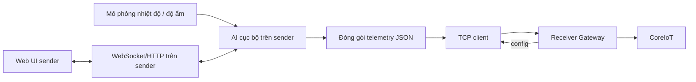
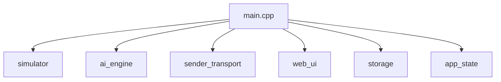
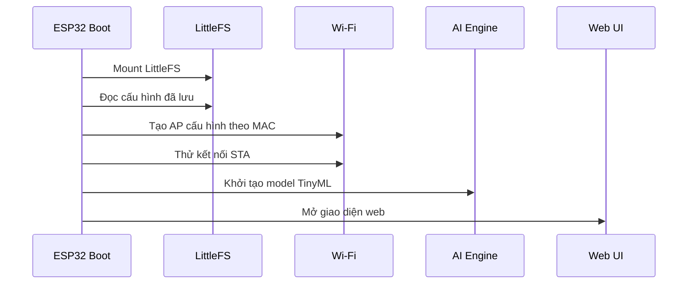
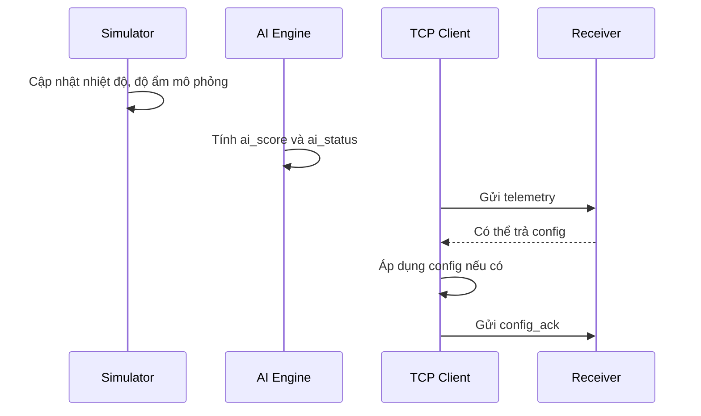

# Sender Node

## 1. Tổng quan

Thư mục `Sender` chứa firmware cho **nút gửi dữ liệu** trong hệ thống IoT. Sender chạy trên `ESP32 DevKit 32 chân` phổ biến, có nhiệm vụ:

- tạo nhiệt độ và độ ẩm mô phỏng;
- chạy mô hình AI cục bộ để suy ra `ai_score` và `ai_status`;
- kết nối Wi-Fi nội bộ;
- gửi dữ liệu định kỳ tới receiver qua `TCP socket`;
- nhận cấu hình ngược từ receiver, chủ yếu là:
  - tên thiết bị;
  - threshold;
- cung cấp giao diện web cấu hình ngay trên chính sender.

Sender là thiết bị “đầu cuối thông minh”: nó tự sinh dữ liệu, tự chạy AI, và chỉ dùng receiver như cổng trung chuyển lên CoreIoT.

```text
Sensor/Simulator + AI local -> Sender -> Receiver -> CoreIoT
```

## 2. Mục tiêu của project

Project sender được thiết kế với các mục tiêu sau:

1. Chạy được trên board `ESP32 DevKit` phổ biến ngoài thị trường.
2. Không phụ thuộc cảm biến vật lý trong giai đoạn phát triển và demo.
3. Giữ đầy đủ logic giống project gốc:
   - có threshold;
   - có AI score;
   - có AI status.
4. Đồng bộ tốt với receiver thông qua TCP.
5. Có giao diện cấu hình rõ ràng cho người dùng cuối.

## 3. Vai trò của sender trong toàn hệ thống

Sender chịu trách nhiệm cho toàn bộ phần dữ liệu nghiệp vụ tại nút biên:

- mô phỏng môi trường nhiệt độ và độ ẩm;
- chạy model AI cục bộ trên chính thiết bị;
- giữ threshold hiện hành;
- gửi telemetry tới receiver;
- nhận lệnh cấu hình từ receiver;
- đồng bộ tên hiển thị do receiver cấp.

Receiver không tính AI thay sender. Điều này giúp phân vai rõ ràng:

- **Sender**: đo/mô phỏng + AI + đóng gói dữ liệu.
- **Receiver**: quản lý + trung chuyển + cloud gateway.

## 4. Kiến trúc tổng thể

### 4.1 Sơ đồ mức cao



### 4.2 Sơ đồ module nội bộ



## 5. Cấu trúc thư mục

```text
Sender/
├─ data/
│  ├─ index.html         Giao diện web người dùng
│  ├─ script.js          Logic frontend
│  └─ styles.css         CSS giao diện
├─ src/
│  ├─ ai_engine.*        Chạy mô hình AI local
│  ├─ app_state.*        Hằng số, state, cấu hình dùng chung
│  ├─ dht_anomaly_model.h Model TinyML nhúng vào firmware
│  ├─ sender_transport.* TCP client tới receiver, gửi/nhận JSON
│  ├─ simulator.*        Mô phỏng nhiệt độ và độ ẩm
│  ├─ storage.*          Đọc/ghi cấu hình LittleFS
│  ├─ web_ui.*           Web server, WebSocket, snapshot UI
│  └─ main.cpp           Điều phối vòng đời sender
└─ platformio.ini        Cấu hình build cho esp32dev
```

## 6. Thông tin phần cứng mục tiêu

Firmware này nhắm tới board:

- `ESP32 DevKit` 32 chân phổ biến
- board PlatformIO: `esp32dev`

Vì đây là board rất thông dụng, project được giữ theo hướng:

- không phụ thuộc phần cứng đặc thù;
- có thể nạp trực tiếp bằng PlatformIO;
- dễ demo và dễ nhân bản nhiều sender.

## 7. Cơ chế mạng của sender

### 7.1 AP cấu hình

Mỗi sender đều phát AP riêng để cấu hình:

- IP: `192.168.7.1`
- SSID: lấy theo MAC để tránh trùng, ví dụ `Sender-ABCDEF12`

Điều này rất quan trọng vì khi có nhiều sender cùng mở AP:

- người dùng vẫn phân biệt được từng thiết bị;
- không bị trùng tên mạng.

### 7.2 Kết nối STA nội bộ

Sender có thể kết nối vào router Wi-Fi chung với receiver.

Nếu người dùng để trống `IP receiver`, sender sẽ tự suy ra địa chỉ receiver theo quy tắc:

- lấy IP STA hiện tại của sender;
- giữ nguyên 3 octet đầu;
- ép octet cuối thành `.100`.

Ví dụ:

- sender có IP `192.168.1.172`
- receiver mặc định suy ra thành `192.168.1.100`

Người dùng vẫn có thể nhập tay IP receiver nếu muốn override.

## 8. Dữ liệu sender gửi đi

Sender gửi dữ liệu tới receiver bằng TCP JSON theo từng dòng.

### 8.1 Gói telemetry

Ví dụ:

```json
{
  "type": "telemetry",
  "device_id": "AA:BB:CC:DD:EE:FF",
  "temperature": 29.8,
  "humidity": 71.2,
  "threshold": 0.55,
  "ai_score": 0.21,
  "ai_status": "NORMAL",
  "latitude": 10.762622,
  "longitude": 106.660172,
  "timestamp": 1776037200000
}
```

### 8.2 Ý nghĩa từng trường

- `device_id`: MAC của sender, dùng làm khóa định danh xuyên suốt toàn hệ.
- `temperature`: nhiệt độ mô phỏng.
- `humidity`: độ ẩm mô phỏng.
- `threshold`: ngưỡng AI sender đang dùng.
- `ai_score`: điểm AI do sender tự suy ra.
- `ai_status`: `NORMAL` hoặc `ANOMALY`.
- `latitude`, `longitude`: tọa độ để receiver chuyển tiếp lên map widget CoreIoT.
- `timestamp`: mốc thời gian do sender gắn vào gói dữ liệu.

## 9. Gói cấu hình sender nhận từ receiver

Receiver có thể gửi xuống sender gói cấu hình như sau:

```json
{
  "type": "config",
  "device_id": "AA:BB:CC:DD:EE:FF",
  "name": "Sender 01",
  "threshold": 0.60,
  "config_version": 3
}
```

Sau khi áp dụng cấu hình, sender sẽ trả `config_ack`:

```json
{
  "type": "config_ack",
  "device_id": "AA:BB:CC:DD:EE:FF",
  "success": true,
  "applied_threshold": 0.60,
  "config_version": 3,
  "message": "Đã áp dụng cấu hình"
}
```

## 10. Luồng hoạt động của sender

### 10.1 Khi sender khởi động



### 10.2 Chu kỳ vận hành chính



## 11. Mô phỏng dữ liệu cảm biến

Sender hiện không đọc cảm biến thật mà mô phỏng dữ liệu, nhằm:

- dễ kiểm thử khi chưa có phần cứng hoàn chỉnh;
- giúp toàn hệ thống chạy demo ổn định;
- giữ logic AI giống môi trường thật.

Dữ liệu mô phỏng được sinh trong `simulator.cpp`.

Nguyên tắc:

- nhiệt độ và độ ẩm thay đổi theo thời gian;
- có độ dao động vừa đủ để AI tạo ra trạng thái `NORMAL/ANOMALY` hợp lý;
- sender vẫn đóng vai trò hoàn chỉnh như khi gắn cảm biến thật.

## 12. AI cục bộ trên sender

Sender giữ lại đầy đủ tinh thần của project gốc:

- có model `dht_anomaly_model.h` nhúng trong firmware;
- có AI score;
- có threshold;
- có trạng thái `NORMAL` hoặc `ANOMALY`.

### 12.1 Vì sao AI để ở sender

Cách này giúp:

- giảm gánh nặng cho receiver;
- dễ mở rộng khi có nhiều sender;
- receiver chỉ cần làm gateway, không phải tính toán cho từng node.

### 12.2 Threshold được xử lý như thế nào

Threshold có thể thay đổi từ nhiều nơi:

- người dùng kéo slider trực tiếp trên sender;
- receiver gửi cấu hình xuống;
- dashboard CoreIoT gọi RPC tới receiver rồi receiver chuyển tiếp xuống sender.

Sender luôn dùng threshold hiện hành để tính AI cục bộ.

## 13. Đồng bộ threshold với receiver

Đây là phần rất quan trọng của cả hệ thống.

### 13.1 Khi người dùng đổi threshold trên sender

1. Sender cập nhật threshold cục bộ.
2. Telemetry kế tiếp sẽ gửi threshold mới lên receiver.
3. Receiver học lại giá trị mới nếu không có phiên cấu hình chờ ACK.
4. Receiver cập nhật state nội bộ và attribute cloud.

### 13.2 Khi receiver đổi threshold cho sender

1. Receiver gửi gói `config` xuống sender.
2. Sender kiểm tra `device_id` có đúng mình không.
3. Nếu hợp lệ, sender áp dụng threshold mới.
4. Sender trả `config_ack`.
5. Telemetry tiếp theo gửi lại threshold mới để receiver và cloud đồng bộ.

## 14. Giao diện web của sender

UI sender được thiết kế để người dùng có thể tự cấu hình một node riêng lẻ mà không cần công cụ ngoài.

### 14.1 Những gì giao diện hiển thị

- `device_id` của sender;
- tên sender do receiver cấp;
- trạng thái kết nối Wi-Fi;
- trạng thái kết nối receiver;
- IP STA hiện tại;
- IP receiver đang dùng;
- nhiệt độ mô phỏng;
- độ ẩm mô phỏng;
- threshold;
- AI score;
- AI status.

### 14.2 Những gì người dùng có thể cấu hình

- SSID Wi-Fi;
- mật khẩu Wi-Fi;
- IP receiver;
- threshold cục bộ.

### 14.3 UX quan trọng

Sender có các điểm UX đáng chú ý:

- nút hiện/ẩn mật khẩu Wi-Fi;
- hiển thị rõ IP receiver suy ra khi để trống cấu hình;
- khóa một số thao tác khi không truy cập đúng qua địa chỉ cấu hình;
- thông báo trạng thái kết nối bằng màu sắc rõ ràng.

## 15. Giải thích từng module trong `src/`

### `app_state.*`

Lưu các cấu hình và biến trạng thái chung:

- Wi-Fi;
- threshold;
- device_id;
- trạng thái TCP;
- thông tin AI hiện thời.

### `simulator.*`

Sinh dữ liệu mô phỏng nhiệt độ và độ ẩm.

Đây là nơi có thể thay bằng driver cảm biến thật trong tương lai mà không làm ảnh hưởng quá nhiều đến phần còn lại.

### `ai_engine.*`

Khởi tạo và chạy mô hình TinyML.

Nhiệm vụ:

- nhận dữ liệu nhiệt độ và độ ẩm;
- suy ra `ai_score`;
- so sánh với threshold;
- cập nhật `ai_status`.

### `sender_transport.*`

Phần giao tiếp với receiver:

- kết nối TCP;
- gửi telemetry;
- nhận config;
- trả ACK;
- giữ trạng thái online/offline tới receiver.

### `storage.*`

Lưu cấu hình sender vào `LittleFS` để không bị mất sau khi reset.

### `web_ui.*`

Xử lý giao diện web:

- dựng snapshot dữ liệu;
- phục vụ file tĩnh;
- gửi realtime qua WebSocket;
- nhận action từ người dùng.

### `main.cpp`

Giữ đúng vai trò điều phối:

- khởi tạo toàn hệ thống;
- gọi tuần tự simulator, AI, Wi-Fi, TCP, UI.

## 16. Cấu hình lưu trên flash

Sender lưu các thông tin cần thiết như:

- Wi-Fi SSID
- Wi-Fi password
- IP receiver cấu hình tay
- threshold hiện hành

Nhờ đó, sau khi khởi động lại sender vẫn quay về trạng thái trước đó.

## 17. Workflow kiểm thử sender

### 17.1 Test độc lập sender

1. Nạp firmware lên ESP32 DevKit.
2. Kết nối vào AP cấu hình của sender.
3. Mở giao diện web.
4. Quan sát nhiệt độ, độ ẩm, AI score và AI status thay đổi theo thời gian.
5. Thử kéo threshold và kiểm tra giá trị hiển thị.

### 17.2 Test sender với receiver

1. Cấu hình sender vào cùng mạng với receiver.
2. Để trống IP receiver hoặc nhập IP đúng của receiver.
3. Quan sát sender kết nối TCP tới receiver.
4. Kiểm tra sender xuất hiện ở receiver dưới dạng:
   - thiết bị lạ nếu chưa được quản lý;
   - card chính thức nếu đã thêm vào danh sách.
5. Thử đổi threshold từ receiver/CoreIoT và kiểm tra sender nhận config.

## 18. Những quyết định thiết kế quan trọng

### Tại sao sender vẫn giữ AI local

Vì đây là cách gần với mô hình thiết bị thật nhất:

- sender chịu trách nhiệm xử lý tại biên;
- receiver chỉ là gateway;
- cloud chỉ là nơi giám sát và điều khiển ở mức cao.

### Tại sao mô phỏng nhiệt độ, độ ẩm

Để:

- giảm phụ thuộc phần cứng khi phát triển;
- demo dễ hơn;
- kiểm thử logic toàn hệ thống nhanh hơn.

### Tại sao dùng TCP tới receiver

Vì hệ thống cần:

- ACK rõ ràng;
- cấu hình hai chiều;
- dễ mở rộng nhiều sender trên cùng Wi-Fi;
- vận hành ổn định hơn so với việc tự xây cơ chế tin cậy trên UDP.

## 19. Hướng mở rộng trong tương lai

Firmware sender hiện có thể mở rộng theo nhiều hướng:

- thay mô phỏng bằng cảm biến thật như DHT, SHT, BME;
- thay tọa độ mô phỏng bằng GPS thật;
- thêm pin/battery monitoring;
- thêm chế độ sleep để tiết kiệm năng lượng;
- thêm hàng đợi cục bộ nếu mạng tới receiver bị gián đoạn.

## 20. Kết luận

Sender là mắt xích đầu tiên trong chuỗi dữ liệu của hệ thống.

Nó chịu trách nhiệm:

- tạo dữ liệu;
- chạy AI;
- giữ threshold cục bộ;
- kết nối tới receiver;
- nhận cấu hình điều khiển từ toàn hệ.

Nếu nhìn toàn bộ project như một dây chuyền, sender là nơi dữ liệu được sinh ra và chuẩn hóa trước khi đi qua receiver để đến CoreIoT.

Một người mới chỉ cần nhớ ba điểm sau là có thể đọc project nhanh:

1. `simulator` tạo dữ liệu đầu vào.
2. `ai_engine` tạo AI score và AI status.
3. `sender_transport` lo kết nối TCP và đồng bộ cấu hình với receiver.